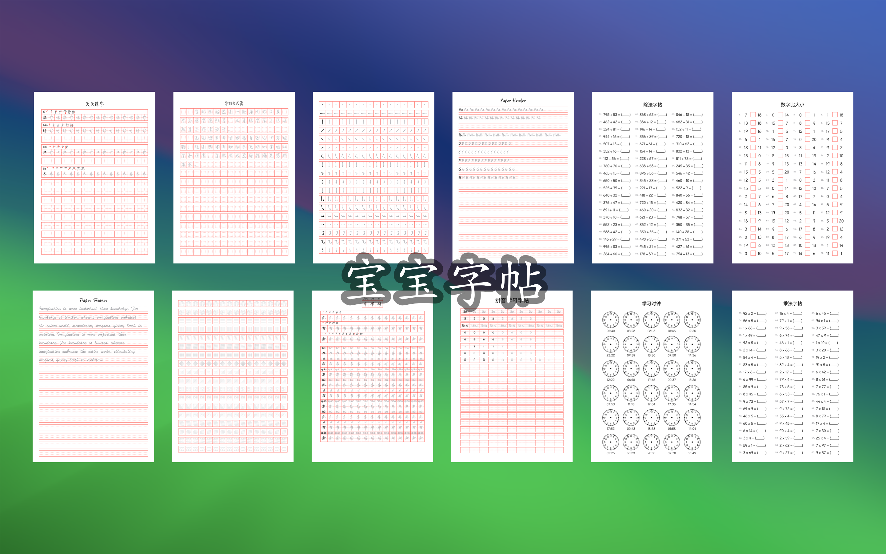
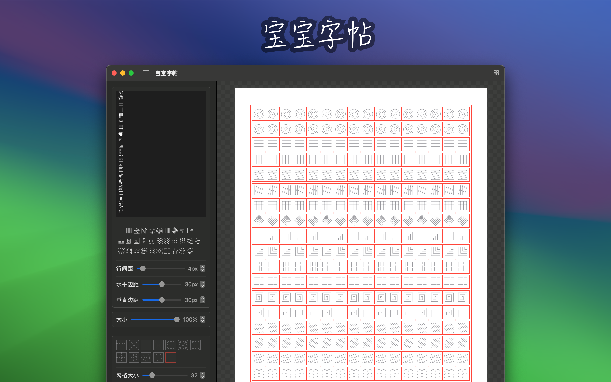

	 
	 
	
	<h1>宝宝字帖</h1>
  <!--rehype:style=border: 0;-->
  

		<a href="./README.md">English</a> • 
		<a href="#常见问题解答">常见问题</a> • 
		<a target="_blank" href="https://wangchujiang.com/#/contact">联系&支持</a>
  

  

    
  

「宝宝字帖」是一款功能强大的字帖生成工具，专为满足不同用户的书写练习需求而设计，并且会根据我自己宝宝的成长持续添加内容。字帖提供了多种类型的字帖生成功能，包括汉字字帖、汉字笔顺描写帖、字母字帖和笔控练习字帖。用户可以根据个人需求，自定义设置字帖模板的各种参数，以便打印和使用。

## 主要特点

### 类型多样

■ **汉字字帖**：适合中文书写练习，帮助用户掌握汉字的正确书写方法。  
■ **汉字笔顺描写帖**：提供详细的汉字笔顺，帮助用户了解每个汉字的正确书写顺序，提升书写准确性。  
■ **拼音字母字帖**：适合小朋友练习书写拼音字母，帮助小朋友正确书写拼音。  
■ **汉字姓名字帖**：适合小朋友练习书写自己的中文名字，帮助小朋友正确书写自己的中文名字。  
■ **英文字母字帖**：适合英文书写练习，帮助用户提高英文字母书写能力。  
■ **笔控练习字帖**：专为书写初学者设计，帮助用户练习握笔姿势和书写力度，提升书写控制力。  
■ **数字字帖**：适合小朋友练习书写数字，提高数字书写能力。  
■ **笔顺查询**：提供汉字的正确书写顺序查询，帮助用户了解和掌握汉字的笔顺。  

### 自定义选项

■ **字体和格子**：选择不同的字体和格子样式，满足各种书写练习需求。  
■ **大小**：调整字帖的字体大小，适应不同年龄段和学习阶段的用户。  
■ **笔顺**：提供汉字笔顺显示，帮助用户了解每个汉字的正确书写顺序。  
■ **颜色**：选择字帖字体的颜色，增加练习的趣味性和视觉效果。  

## 常见问题解答

## 使用方法

1. 选择字帖类型：选择需要生成的字帖类型（汉字、汉字笔顺描写、英文字母或笔控练习）。
2. 自定义设置：根据需要设置字体、格子样式、字体大小、笔顺显示和颜色。
3. 生成模板：生成自定义的字帖模板。
4. 下载打印：通过电脑下载字帖模板，并打印出来进行书写练习。

### 适合什么样的人群？

■ 学龄儿童：帮助学龄儿童练习书写，提高汉字和英文字母的书写能力。  
■ 书法爱好者：提供专业的字帖模板，帮助书法爱好者进行临摹和练习。  
■ 教育工作者：为教师提供教学工具，便于学生练习书写。  
■ 书写初学者：通过笔控练习字帖，帮助初学者掌握正确的握笔姿势和书写力度。  

宝宝字帖旨在通过灵活的定制选项和多样的功能，帮助用户轻松生成符合个人需求的字帖模板，提升书写能力。无论是初学者还是书写爱好者，都可以从中受益，享受书写练习的乐趣。

<!--idoc:config:
title: 「宝宝字帖」是一款功能强大的字帖生成工具，专为满足不同用户的书写练习需求而设计，并且会根据我自己宝宝的成长持续添加内容。 - 
-->