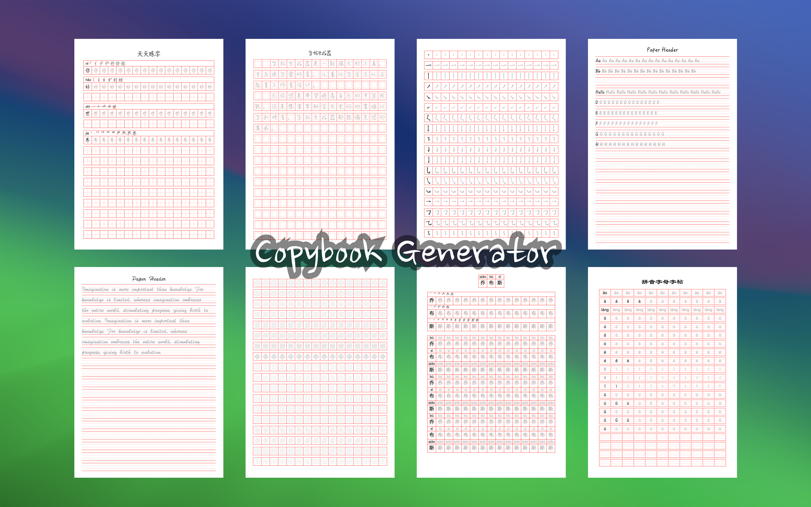
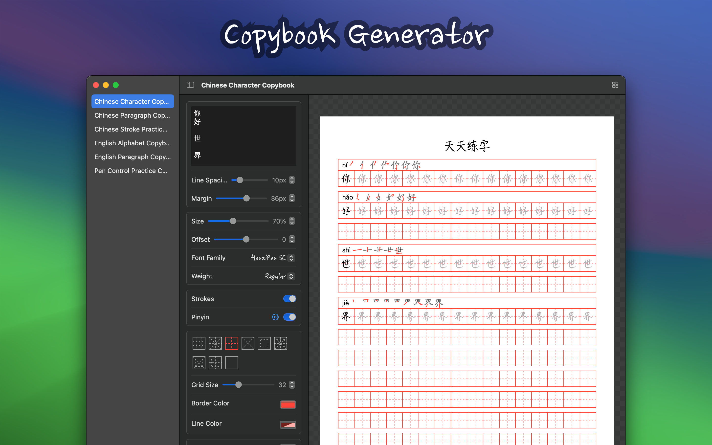
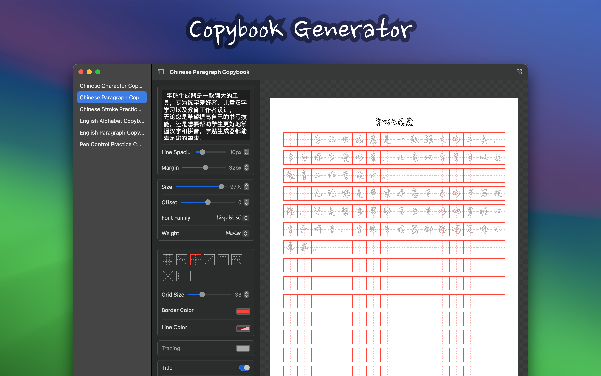
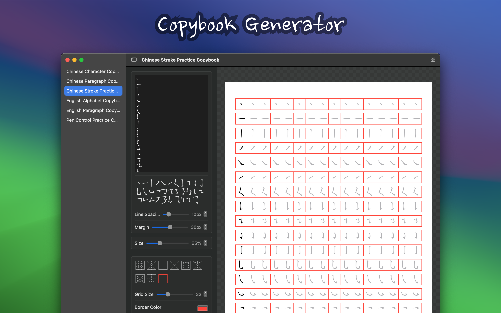
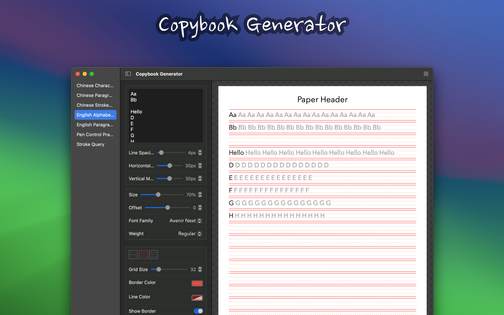
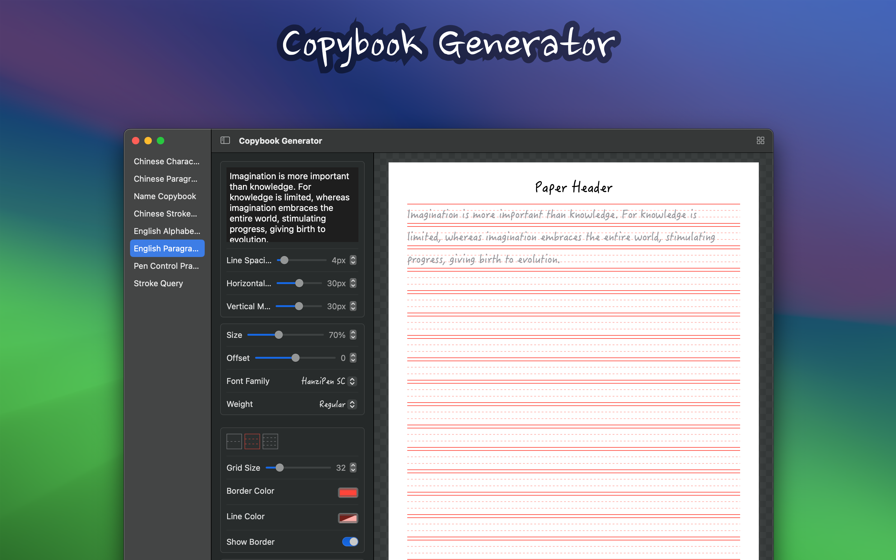
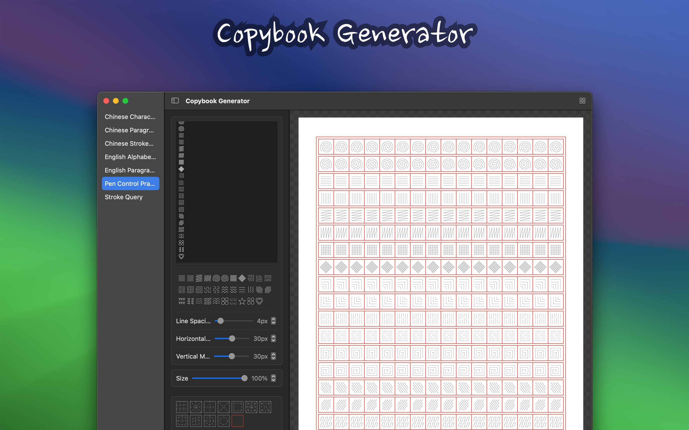
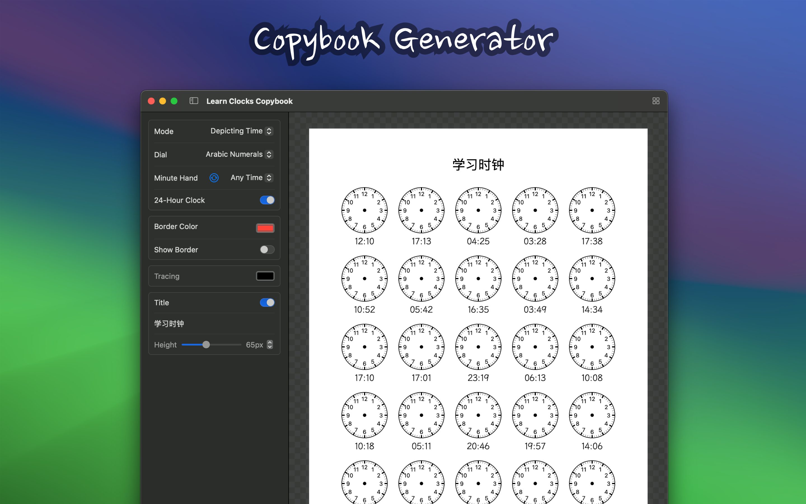

<!--idoc:ignore:start-->
> [!TIP]
> Declaration: This project is not an open-source project. The repository serves as the official website, used to collect issues and user demands. This is done to save costs, because without an official website, the application cannot pass the review.
<!--idoc:ignore:end-->

	 
	 
  
	<h1>Copybook Generator</h1>
  <!--rehype:style=border: 0;-->
  

		<a href="README.zh.md">中文</a> • 
		<a href="#frequently-asked-questions">FAQ</a> • 
		<a href="#font-download">Fonts</a> • 
    <a target="_blank" href="https://github.com/jaywcjlove/copybook-generator/issues/new?template=bug_report.yml">Contact & Support</a> • 
    <a href="./CHANGELOG.md">Changelog</a>
  

  

    
  

minimum OS requirement: `macOS 14.0`

"Copybook Generator" is a powerful copybook generation tool designed to meet the writing practice needs of different users. It continuously adds content based on my own baby's growth. The app offers a wide range of copybook types, including Chinese character copybooks (with built-in default practice content), Chinese stroke practice, Pinyin and English alphabet, English word and paragraph practice, pen control practice, number and math exercises, and clock learning. Users can customize fonts, grids, colors, exercise counts, and more, then preview multi-page sheets and export them as multi-page PDFs for printing.

## Main Features

### Diverse Types

- **Chinese Character Copybook**: Suitable for practicing Chinese writing, with built-in default practice content so you can start right away.  
- **Chinese Character Stroke Order Copybook**: Provides detailed stroke orders for Chinese characters, helping users understand the correct writing sequence of each character and improve writing accuracy.  
- **Pinyin Letter Copybook**: Suitable for children to practice writing Pinyin letters, helping them write Pinyin correctly.  
- **Chinese Name Copybook**: Suitable for children to practice writing their Chinese names, helping them write their names correctly.  
- **English Alphabet Copybook**: Suitable for practicing English writing, helping users improve their English letter writing skills.  
- **English Word Copybook**: Practice English vocabulary writing with customizable word lists.  
- **English Paragraph Copybook**: Practice writing full English paragraphs for fluency and layout.  
- **Pen Control Practice Copybook**: Designed for beginners in writing, helping users practice pen holding posture and writing pressure, improving writing control.  
- **Number Copybook**: Suitable for children to practice writing numbers, helping them improve their number writing skills.  
- **Stroke Order Query**: Provides the correct stroke order for Chinese characters, helping users understand and master the stroke order of Chinese characters.  
- **Number Comparison**  
- **Add/Sub Operations Copybook**  
- **Mixed Add/Sub Copybook**  
- **Multiplication Copybook**  
- **Division Copybook**  
- **Vertical Calculation Copybook**  
- **Learn Clocks Copybook**  

### Customization Options

- **Fonts and Grids**: Choose different fonts and grid styles to meet various writing practice needs.  
- **Size**: Adjust the font size of the copybook to suit users of different age groups and learning stages.  
- **Stroke Order**: Provides the stroke order of Chinese characters, helping users understand the correct writing sequence of each character.  
- **Color**: Choose the color of the copybook font to add fun and visual effects to the practice.  
- **Exercise Count**: Customize the number of questions for math and clock practice copybooks.  
- **Default Practice Content**: Chinese character copybooks include built-in default practice text so you can start practicing right away.  
- **Multi-page Preview & PDF Export**: Preview multi-page copybooks and export them as multi-page PDF files for easy printing.  
- **Localization**: Expanded multi-language support for a wider range of users.  

## Font Download

You can download the required fonts from the websites below, then restart `Copybook Generator` and select the desired font.

- [`Free Font`](https://github.com/jaywcjlove/free-font) includes `Chinese` and `English` fonts
- [Ziti Tianxia](https://www.fonts.net.cn/) includes `Chinese` and `English` fonts
- [ChinaZ Fonts](https://font.chinaz.com/) includes `Chinese` and `English` fonts
- [Google Fonts](https://fonts.google.com/) includes `Chinese` and `English` fonts
- [Font Share](https://www.fontshare.com/) includes `English` fonts
- [Font Squirrel](https://www.fontsquirrel.com/)
- [Font Meme](https://fontmeme.com/ziti/chinese-fonts/)
- [Fontesk](https://fontesk.com/fonts/)

## Frequently Asked Questions

## How to Use

1. Choose the type of copybook: Select the type you need (Chinese character, stroke practice, alphabet, English words, math, clocks, pen control, and more).
2. Customize settings: Set fonts, grid styles, font size, stroke order, color, and exercise count as needed.
3. Preview: Review the multi-page copybook preview.
4. Export and print: Export as a multi-page PDF and print it for writing practice.

### Suitable for Whom?

■ School-aged children: Helps school-aged children practice writing and improve their ability to write Chinese characters and English letters.  
■ Calligraphy enthusiasts: Provides professional copybook templates to help calligraphy enthusiasts practice and trace.  
■ Educators: Provides teaching tools for teachers to facilitate students' writing practice.  
■ Writing beginners: Helps beginners master the correct grip posture and writing pressure through pen control practice copybooks.  

Copybook Generator aims to help users easily generate copybook templates that meet their individual needs through flexible customization options and diverse functions, enhancing their writing skills. Whether you are a beginner or a writing enthusiast, you can benefit from it and enjoy the fun of writing practice.

<!--idoc:config:
site: Copybook Generator
title: Copybook Generator is a powerful copybook generation tool designed to meet the writing practice needs of different users - 
keywords: Copybook Generator, Chinese Practice, English Word Copybook, Alphabet Practice, Math Copybook, Stroke Order, Multi-page PDF, Custom Copybooks
-->
