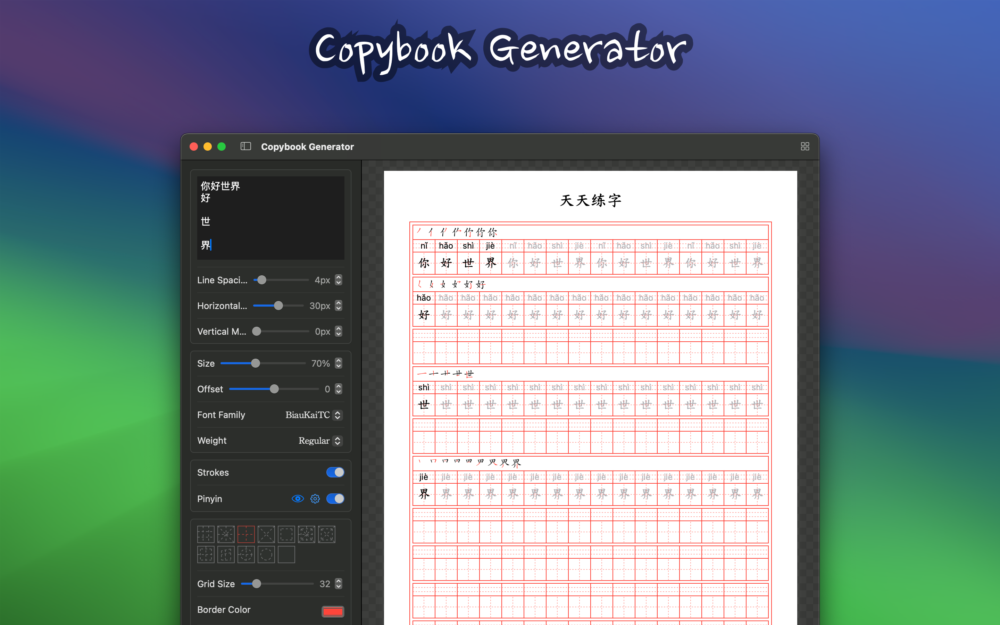
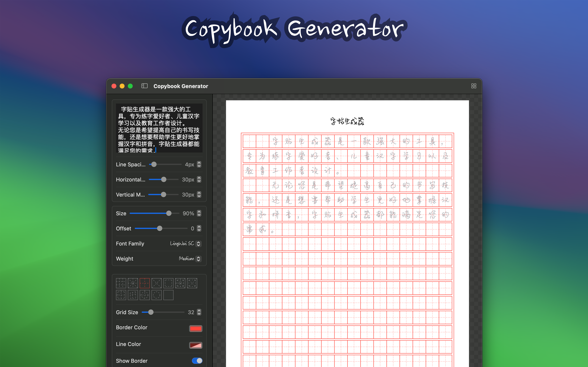
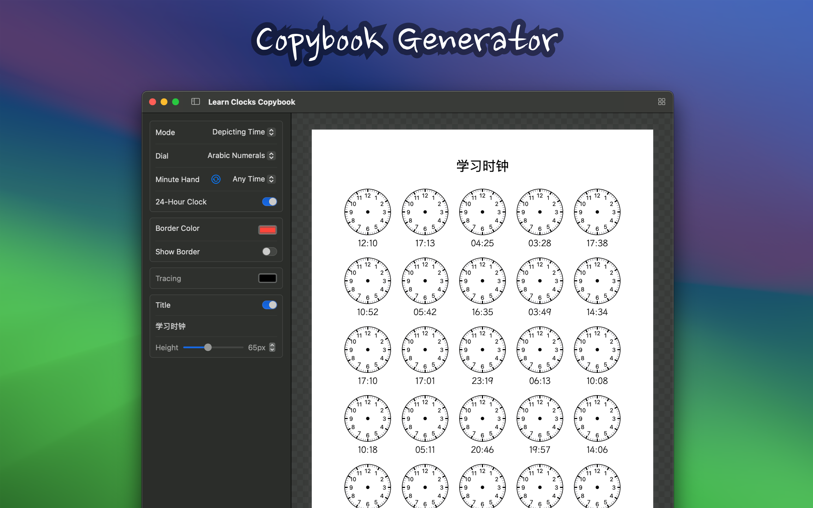

<!--idoc:ignore:start-->
> [!TIP]
> Declaration: This project is not an open-source project. The repository serves as the official website, used to collect issues and user demands. This is done to save costs, because without an official website, the application cannot pass the review.
<!--idoc:ignore:end-->

	 
	 
  
	<h1>Copybook Generator</h1>
  <!--rehype:style=border: 0;-->
  

		<a href="README.zh.md">中文</a> • 
		<a href="#frequently-asked-questions">FAQ</a> • 
		<a href="#font-download">Fonts</a> • 
		<a target="_blank" href="https://wangchujiang.com/#/contact">Contact & Support</a>
  

  

    
  

minimum OS requirement: `macOS 14.0`

"Copybook Generator" is a powerful copybook generation tool designed to meet the writing practice needs of different users. It continuously adds content based on my own baby's growth. The copybook offers various types of copybook generation functions, including Chinese character copybooks, Chinese stroke practice copybooks, alphabet copybooks, and pen control practice copybooks. Users can customize the copybook templates with various parameters according to their needs for printing and use.

## Main Features

### Diverse Types

■ **Chinese Character Copybook**: Suitable for practicing Chinese writing, helping users master the correct writing methods of Chinese characters.  
■ **Chinese Character Stroke Order Copybook**: Provides detailed stroke orders for Chinese characters, helping users understand the correct writing sequence of each character and improve writing accuracy.  
■ **Pinyin Letter Copybook**: Suitable for children to practice writing Pinyin letters, helping them write Pinyin correctly.  
■ **Chinese Name Copybook**: Suitable for children to practice writing their Chinese names, helping them write their names correctly.  
■ **English Alphabet Copybook**: Suitable for practicing English writing, helping users improve their English letter writing skills.  
■ **Pen Control Practice Copybook**: Designed for beginners in writing, helping users practice pen holding posture and writing pressure, improving writing control.  
■ **Number Copybook**: Suitable for children to practice writing numbers, helping them improve their number writing skills.  
■ **Stroke Order Query**: Provides the correct stroke order for Chinese characters, helping users understand and master the stroke order of Chinese characters.  
■ **English Paragraph Copybook**  
■ **Number Comparison**  
■ **Add/Sub Operations Copyboo**  
■ **Mixed Add/Sub Copybook**  
■ **Multiplication Copybook**  
■ **Division Copybook**  
■ **Vertical Calculation Copybook**  
■ **Learn Clocks Copybook**  

### Customization Options

■ **Fonts and Grids**: Choose different fonts and grid styles to meet various writing practice needs.  
■ **Size**: Adjust the font size of the copybook to suit users of different age groups and learning stages.  
■ **Stroke Order**: Provides the stroke order of Chinese characters, helping users understand the correct writing sequence of each character.  
■ **Color**: Choose the color of the copybook font to add fun and visual effects to the practice.  

## Font Download

You can download the required fonts from the websites below, then restart `Copybook Generator` and select the desired font.

- [`Free Font`](https://github.com/jaywcjlove/free-font) includes `Chinese` and `English` fonts
- [Ziti Tianxia](https://www.fonts.net.cn/) includes `Chinese` and `English` fonts
- [ChinaZ Fonts](https://font.chinaz.com/) includes `Chinese` and `English` fonts
- [Google Fonts](https://fonts.google.com/) includes `Chinese` and `English` fonts
- [Font Share](https://www.fontshare.com/) includes `English` fonts
- [Font Squirrel](https://www.fontsquirrel.com/)
- [Font Meme](https://fontmeme.com/ziti/chinese-fonts/)
- [Fontesk](https://fontesk.com/fonts/)

## Frequently Asked Questions

## How to Use

1. Choose the type of copybook: Select the type of copybook you need to generate (Chinese character, Chinese stroke practice, alphabet, or pen control practice).
2. Customize settings: Set fonts, grid styles, font size, stroke order display, and color as needed.
3. Generate template: Generate a customized copybook template.
4. Download and print: Download the copybook template via computer and print it for writing practice.

### Suitable for Whom?

■ School-aged children: Helps school-aged children practice writing and improve their ability to write Chinese characters and English letters.  
■ Calligraphy enthusiasts: Provides professional copybook templates to help calligraphy enthusiasts practice and trace.  
■ Educators: Provides teaching tools for teachers to facilitate students' writing practice.  
■ Writing beginners: Helps beginners master the correct grip posture and writing pressure through pen control practice copybooks.  

Copybook Generator aims to help users easily generate copybook templates that meet their individual needs through flexible customization options and diverse functions, enhancing their writing skills. Whether you are a beginner or a writing enthusiast, you can benefit from it and enjoy the fun of writing practice.

<!--idoc:config:
site: Copybook Generator
title: Copybook Generator is a powerful copybook generation tool designed to meet the writing practice needs of different users - 
keywords: Copybook Generator, Chinese Practice, Alphabet Practice, Stroke Order, Custom Copybooks
-->
