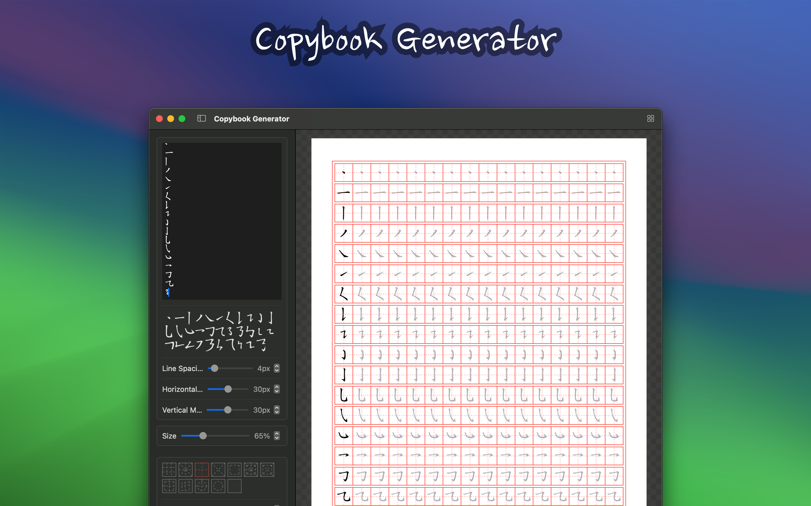

	 
	 
	
	<h1>Copybook Generator</h1>
  <!--rehype:style=border: 0;-->
  

		<a href="./README.zh.md">中文</a> • 
		<a href="#frequently-asked-questions">FAQ</a> • 
		<a target="_blank" href="https://wangchujiang.com/#/contact">Contact & Support</a>
  

  

    
  

"Copybook Generator" is a powerful copybook generation tool designed to meet the writing practice needs of different users. It continuously adds content based on my own baby's growth. The copybook offers various types of copybook generation functions, including Chinese character copybooks, Chinese stroke practice copybooks, alphabet copybooks, and pen control practice copybooks. Users can customize the copybook templates with various parameters according to their needs for printing and use.

## Main Features

### Diverse Types

■ Chinese Character Copybook: Suitable for Chinese writing practice, helping users master the correct writing method of Chinese characters.  
■ Chinese Stroke Practice Copybook: Provides detailed stroke order of Chinese characters, helping users understand the correct writing sequence of each character and improve writing accuracy.  
■ Alphabet Copybook: Suitable for English writing practice, helping users improve their ability to write English letters.  
■ Pen Control Practice Copybook: Specially designed for writing beginners, helping users practice grip posture and writing pressure to enhance writing control.  

### Customization Options

■ Fonts and Grids: Choose different fonts and grid styles to meet various writing practice needs.  
■ Size: Adjust the font size of the copybook to suit users of different age groups and learning stages.  
■ Stroke Order: Provides the stroke order of Chinese characters, helping users understand the correct writing sequence of each character.  
■ Color: Choose the color of the copybook font to add fun and visual effects to the practice.  

## Frequently Asked Questions

## How to Use

1. Choose the type of copybook: Select the type of copybook you need to generate (Chinese character, Chinese stroke practice, alphabet, or pen control practice).
2. Customize settings: Set fonts, grid styles, font size, stroke order display, and color as needed.
3. Generate template: Generate a customized copybook template.
4. Download and print: Download the copybook template via computer and print it for writing practice.

### Suitable for Whom?

■ School-aged children: Helps school-aged children practice writing and improve their ability to write Chinese characters and English letters.  
■ Calligraphy enthusiasts: Provides professional copybook templates to help calligraphy enthusiasts practice and trace.  
■ Educators: Provides teaching tools for teachers to facilitate students' writing practice.  
■ Writing beginners: Helps beginners master the correct grip posture and writing pressure through pen control practice copybooks.  

Copybook Generator aims to help users easily generate copybook templates that meet their individual needs through flexible customization options and diverse functions, enhancing their writing skills. Whether you are a beginner or a writing enthusiast, you can benefit from it and enjoy the fun of writing practice.

<!--idoc:config:
title: Copybook Generator is a powerful copybook generation tool designed to meet the writing practice needs of different users - 
-->