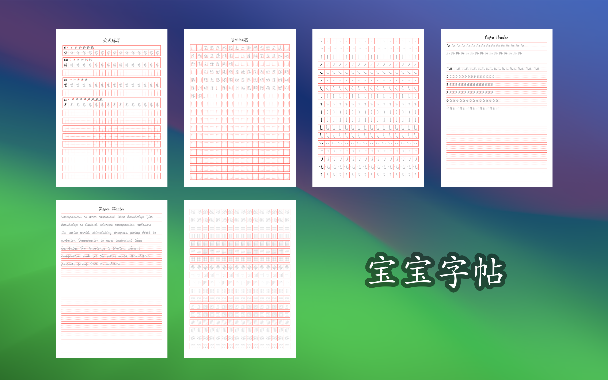
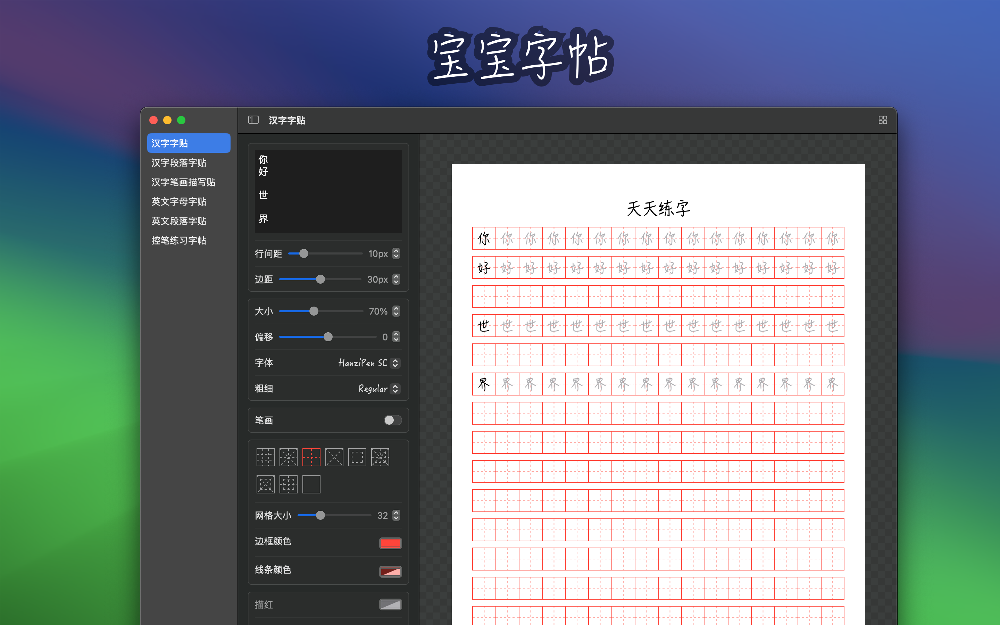
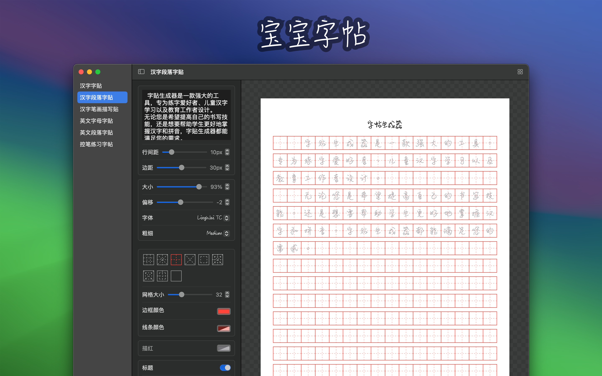
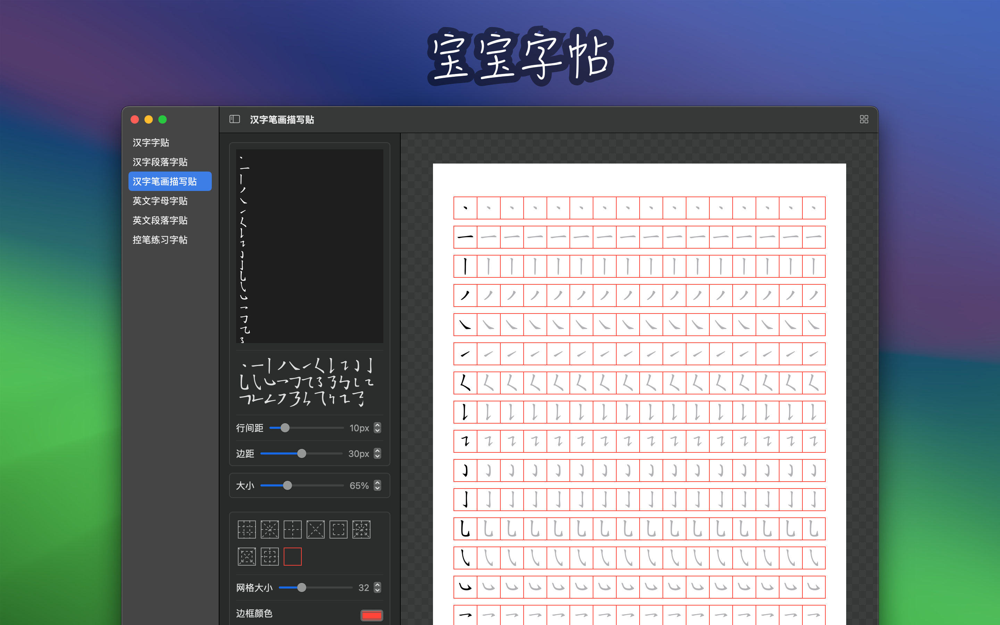
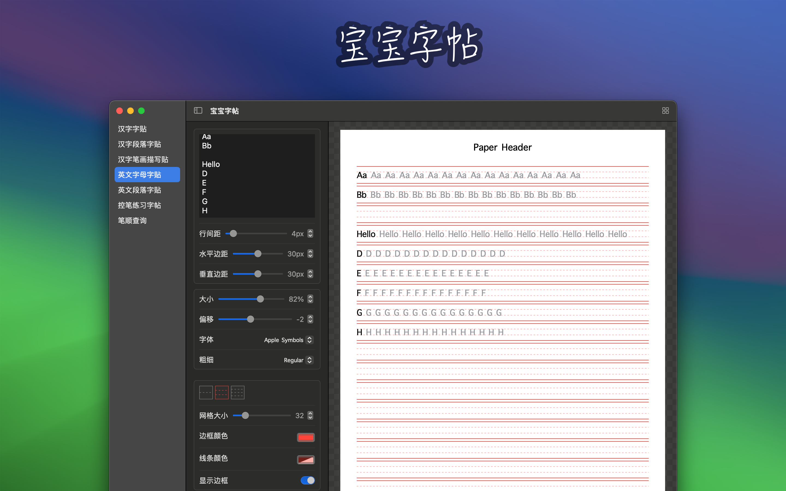
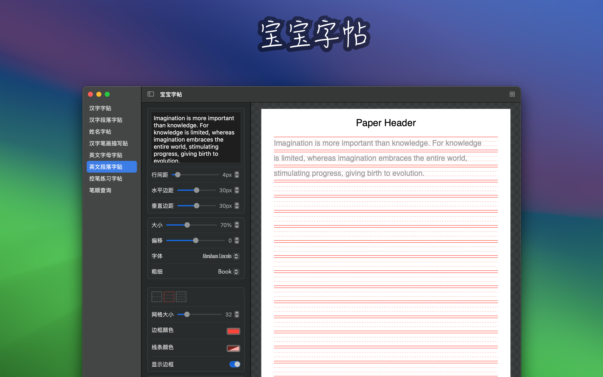
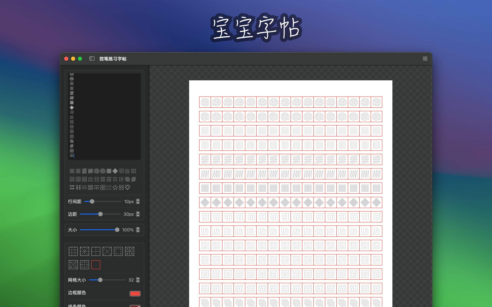
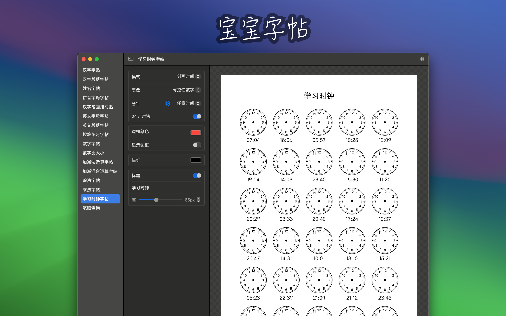

<!--idoc:ignore:start-->
> [!TIP]
> 声明：此项目并非开源项目，仓库作为官方网站，用于收集问题和用户需求。这样做是为了节省成本，因为没有官网，应用无法通过审核。
<!--idoc:ignore:end-->

	 
	 
	
	<h1>宝宝字帖</h1>
  <!--rehype:style=border: 0;-->
  

	<a href="README.md">English</a> • 
	<a href="#字体下载">字体</a> • 
	<a href="#常见问题解答">常见问题</a> • 
	<a target="_blank" href="https://github.com/jaywcjlove/copybook-generator/issues/new?template=bug_report_cn.yml">联系&支持</a> • 
	<a href="./CHANGELOG.zh.md">更新日志</a>
  

  

    
  

最低操作系统要求：`macOS 14.0`

「宝宝字帖」是一款功能强大的字帖生成工具，专为满足不同用户的书写练习需求而设计，并且会根据我自己宝宝的成长持续添加内容。应用提供多种字帖类型，包括汉字字帖（内置默认练习内容）、汉字笔顺描写、拼音与英文字母、英文单词与段落、笔控练习、数字与数学运算，以及学习时钟等。用户可自定义字体、格子、颜色、题目数量等参数，支持多页字帖预览，并导出为多页 PDF 方便打印使用。

## 主要特点

### 类型多样

- **汉字字帖**：适合中文书写练习，内置默认练习内容，开箱即可练习，帮助用户掌握汉字的正确书写方法。  
- **汉字笔顺描写帖**：提供详细的汉字笔顺，帮助用户了解每个汉字的正确书写顺序，提升书写准确性。  
- **汉字姓名字帖**：适合小朋友练习书写自己的中文名字，帮助小朋友正确书写自己的中文名字。  
- **拼音字母字帖**：适合小朋友练习书写拼音字母，帮助小朋友正确书写拼音。  
- **英文字母字帖**：适合英文书写练习，帮助用户提高英文字母书写能力。  
- **英文单词字帖**：适合练习英文单词书写，可自定义单词列表。  
- **英文段落字帖**：适合练习英文段落书写，提升书写流畅度与版面感。  
- **笔控练习字帖**：专为书写初学者设计，帮助用户练习握笔姿势和书写力度，提升书写控制力。  
- **数字字帖**：适合小朋友练习书写数字，提高数字书写能力。  
- **笔顺查询**：提供汉字的正确书写顺序查询，帮助用户了解和掌握汉字的笔顺。  
- **数字比大小**  
- **加减运算字帖**  
- **加减混合运算字帖**  
- **除法字帖**  
- **乘法字帖**  
- **竖式计算字帖**  
- **学习时钟字帖**  

### 自定义选项

- **字体和格子**：选择不同的字体和格子样式，满足各种书写练习需求。  
- **大小**：调整字帖的字体大小，适应不同年龄段和学习阶段的用户。  
- **笔顺**：提供汉字笔顺显示，帮助用户了解每个汉字的正确书写顺序。  
- **颜色**：选择字帖字体的颜色，增加练习的趣味性和视觉效果。  
- **题目数量**：支持自定义数学与时钟练习字帖的题目数量。  
- **默认练习内容**：中文汉字字帖内置默认练习内容，开箱即可练习。  
- **多页预览与 PDF 导出**：支持多页字帖预览，并导出为多页 PDF，方便打印使用。  
- **多语言本地化**：扩展支持更多语言本地化，覆盖更广的使用人群。  

## 字体下载

可通过下面字体网站，下载需要的字体，然后重启字体宝宝，选择需要的字体。

- [字集](https://wordshub.github.io/free-font/) 包含 `中文` `英文` 字体
- [字体天下](https://www.fonts.net.cn/) 包含 `中文` `英文` 字体
- [ChinaZ Fonts](https://font.chinaz.com/) 包含 `中文` `英文` 字体
- [Google Fonts](https://fonts.google.com/) 包含 `中文` `英文` 字体
- [Font Share](https://www.fontshare.com/) 包含 `英文` 字体
- [Font Squirrel](https://www.fontsquirrel.com/)
- [Font Meme](https://fontmeme.com/ziti/chinese-fonts/)
- [Fontesk](https://fontesk.com/fonts/)

## 常见问题解答

### 使用方法

1. 选择字帖类型：选择需要生成的字帖类型（汉字、笔顺描写、字母、英文单词、数学运算、学习时钟、笔控练习等）。
2. 自定义设置：根据需要设置字体、格子样式、字体大小、笔顺显示、颜色和题目数量等。
3. 预览字帖：查看多页字帖预览效果。
4. 导出打印：导出为多页 PDF，打印后进行书写练习。

### 适合什么样的人群？

■ 学龄儿童：帮助学龄儿童练习书写，提高汉字和英文字母的书写能力。  
■ 书法爱好者：提供专业的字帖模板，帮助书法爱好者进行临摹和练习。  
■ 教育工作者：为教师提供教学工具，便于学生练习书写。  
■ 书写初学者：通过笔控练习字帖，帮助初学者掌握正确的握笔姿势和书写力度。  

宝宝字帖旨在通过灵活的定制选项和多样的功能，帮助用户轻松生成符合个人需求的字帖模板，提升书写能力。无论是初学者还是书写爱好者，都可以从中受益，享受书写练习的乐趣。

<!--idoc:config:
title: 「宝宝字帖」是一款功能强大的字帖生成工具，专为满足不同用户的书写练习需求而设计，并且会根据我自己宝宝的成长持续添加内容。 - 
keywords: 宝宝字帖, 字帖生成, 汉字练习, 英文单词字帖, 英文字母练习, 数学字帖, 笔顺描写, 多页PDF, 书写练习, 自定义字帖, 教育工具, 笔控练习, 儿童书法
description: 一款功能强大的字帖生成工具，专为满足不同用户的书写练习需求而设计。支持汉字、英文单词、数学运算、学习时钟等多种字帖，可自定义题目数量，支持多页预览与 PDF 导出
-->